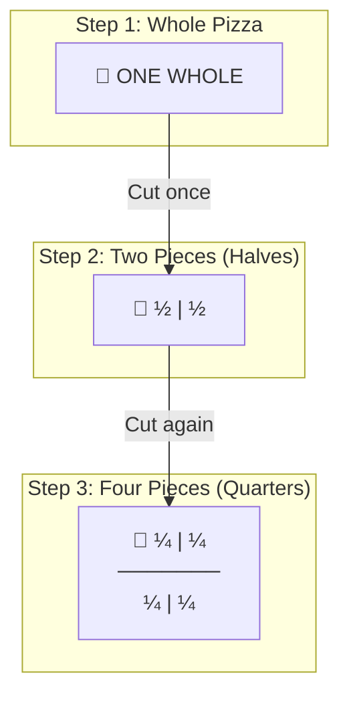
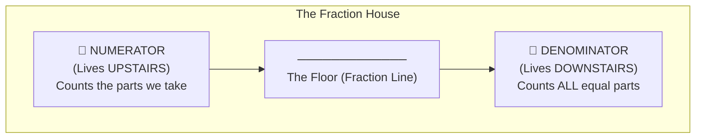
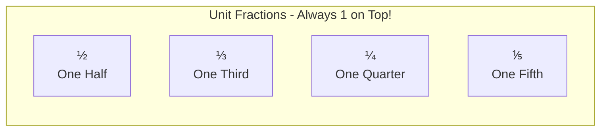
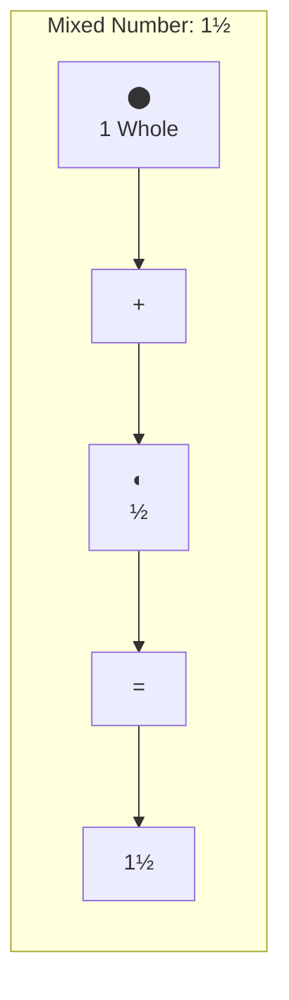
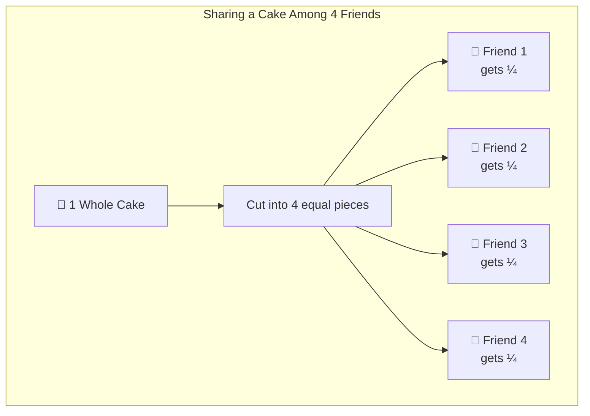
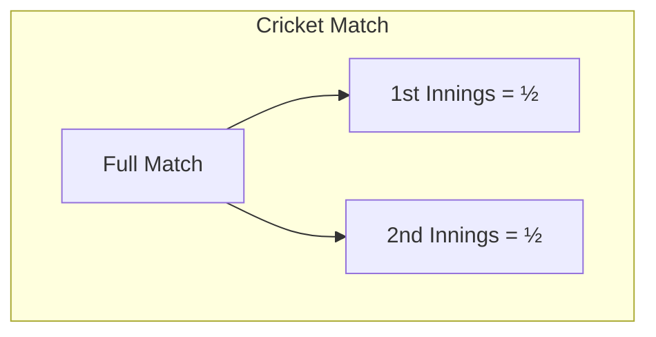
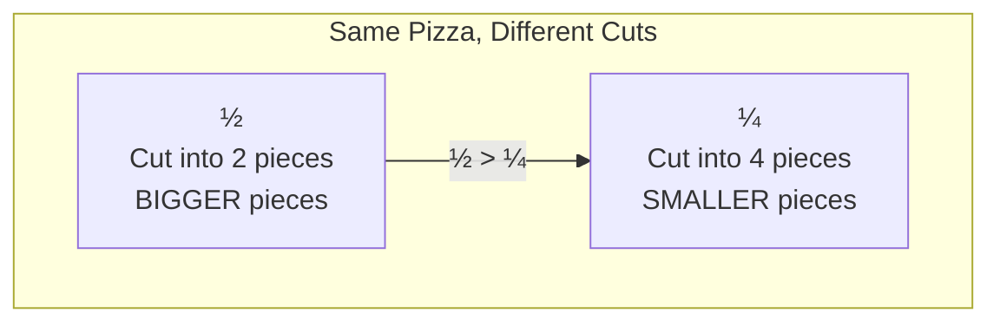
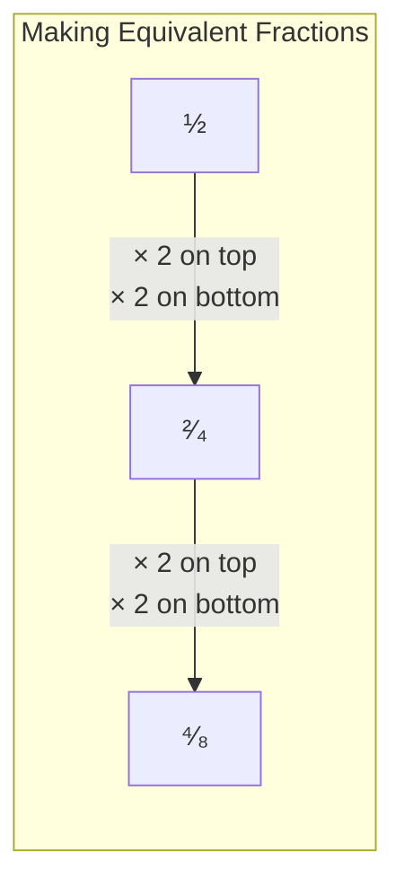
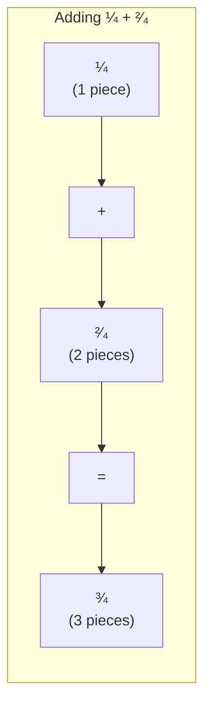
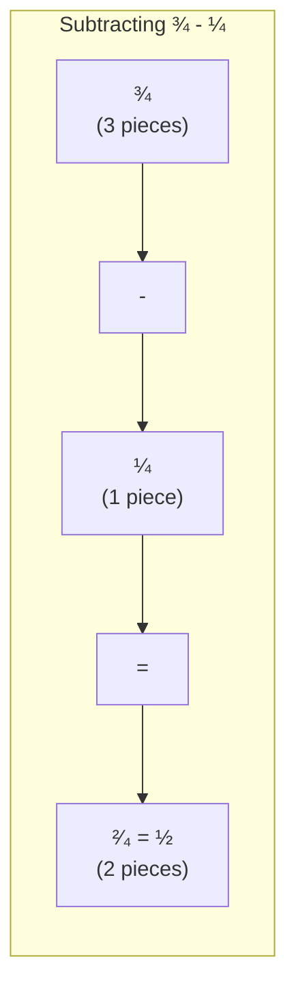

# 🎯 Fun with Fractions! 
## A Fun Learning Adventure for Young Mathematicians

> **For:** Class 2 Students (Age 6-7)  
> **Aligned with:** NCERT/CBSE Curriculum  
> **Prerequisites:** Addition, Subtraction, Multiplication, Basic Division

---

## 📚 Table of Contents

1. [What is a Fraction? - The Pizza Story](#1-what-is-a-fraction---the-pizza-story)
2. [Parts of a Fraction - Meet the Fraction Family](#2-parts-of-a-fraction---meet-the-fraction-family)
3. [Types of Fractions](#3-types-of-fractions)
4. [Fractions in Real Life - Why Do We Need Them?](#4-fractions-in-real-life---why-do-we-need-them)
5. [Comparing Fractions - Which is Bigger?](#5-comparing-fractions---which-is-bigger)
6. [Equivalent Fractions - Same but Different!](#6-equivalent-fractions---same-but-different)
7. [Adding Fractions - Putting Pieces Together](#7-adding-fractions---putting-pieces-together)
8. [Subtracting Fractions - Taking Pieces Away](#8-subtracting-fractions---taking-pieces-away)
9. [Fun Activities & Games](#9-fun-activities--games)
10. [Practice Worksheets](#10-practice-worksheets)

---

## 1. What is a Fraction? - The Pizza Story 🍕

### Story Time! 

> **Imagine this:** Mom brings home ONE pizza for you and your sister. 
> You need to share it EQUALLY. What do you do?
> 
> You cut it into TWO equal pieces! 
> Each piece is called **ONE HALF** or **½**

### Understanding "Whole" and "Parts"

A **WHOLE** is something complete - like:
- 🍕 One full pizza
- 🍎 One whole apple  
- 🍫 One chocolate bar
- 🎂 One birthday cake

A **FRACTION** is when we divide the whole into **EQUAL PARTS**

```
┌─────────────────────────────────────────┐
│                                         │
│   WHOLE PIZZA         HALF PIZZA        │
│                                         │
│      ⬤                  ◐              │
│   (Complete)         (1 out of 2)       │
│                                         │
│      = 1               = ½              │
│                                         │
└─────────────────────────────────────────┘
```

### Visual: Cutting a Pizza



### Key Learning Point 🔑

> **A fraction tells us HOW MANY PARTS we have OUT OF the TOTAL EQUAL PARTS**

---

## 2. Parts of a Fraction - Meet the Fraction Family 👨‍👩‍👧‍👦

Every fraction has TWO important parts:

```
        1      ← NUMERATOR (How many parts we HAVE)
       ───
        2      ← DENOMINATOR (Total EQUAL parts)
```

### The Fraction House 🏠



### Remember This Rhyme! 🎵

> 🎶 *"Denominator DOWN below,*  
> *Tells how many parts in total, don't you know!*  
> *Numerator on the TOP so high,*  
> *Counts the parts that catch your eye!"* 🎶

### Examples with Pictures

| Fraction | Picture | Meaning |
|:--------:|:-------:|:--------|
| ½ | 🟦⬜ | 1 part colored out of 2 total parts |
| ⅓ | 🟦⬜⬜ | 1 part colored out of 3 total parts |
| ¼ | 🟦⬜⬜⬜ | 1 part colored out of 4 total parts |
| ¾ | 🟦🟦🟦⬜ | 3 parts colored out of 4 total parts |
| ⅔ | 🟦🟦⬜ | 2 parts colored out of 3 total parts |

### Visual Representation of Common Fractions

```
ONE HALF (½)
┌──────────┬──────────┐
│ ████████ │          │
│ ████████ │          │
│   (1)    │   (2)    │
└──────────┴──────────┘
1 shaded out of 2 = ½

ONE THIRD (⅓)
┌───────┬───────┬───────┐
│ █████ │       │       │
│ █████ │       │       │
│  (1)  │  (2)  │  (3)  │
└───────┴───────┴───────┘
1 shaded out of 3 = ⅓

ONE QUARTER (¼)
┌─────┬─────┬─────┬─────┐
│ ███ │     │     │     │
│ ███ │     │     │     │
│ (1) │ (2) │ (3) │ (4) │
└─────┴─────┴─────┴─────┘
1 shaded out of 4 = ¼

THREE QUARTERS (¾)
┌─────┬─────┬─────┬─────┐
│ ███ │ ███ │ ███ │     │
│ ███ │ ███ │ ███ │     │
│ (1) │ (2) │ (3) │ (4) │
└─────┴─────┴─────┴─────┘
3 shaded out of 4 = ¾
```

---

## 3. Types of Fractions

### 3.1 Unit Fractions (The "One" Family)

Unit fractions always have **1** on top (numerator = 1)



| Fraction | How to Say It | Meaning |
|:--------:|:--------------|:--------|
| ½ | One Half | 1 part out of 2 |
| ⅓ | One Third | 1 part out of 3 |
| ¼ | One Quarter (or One Fourth) | 1 part out of 4 |
| ⅕ | One Fifth | 1 part out of 5 |
| ⅙ | One Sixth | 1 part out of 6 |

### 3.2 Proper Fractions (Top is Smaller)

The **numerator is SMALLER** than the denominator.  
The value is **LESS than 1 whole**.

```
Examples:    ½    ⅓    ¾    ⅖    ⅚
             ↓    ↓    ↓    ↓    ↓
           1<2  1<3  3<4  2<5  5<6  ✓ All proper!
```

### Visual: Proper Fraction (¾)

```
    ┌───────────────────────────────────┐
    │ ████ │ ████ │ ████ │      │      │
    │ ████ │ ████ │ ████ │      │      │
    └───────────────────────────────────┘
           3 out of 4 = ¾
    
    This is LESS than a full bar! ✓
```

### 3.3 Improper Fractions (Top is Bigger) - For Advanced Learners

The **numerator is BIGGER** than the denominator.  
The value is **MORE than 1 whole**.

```
Examples:    5/4    7/3    9/2
             ↓      ↓      ↓
            5>4    7>3    9>2  ✓ All improper!
```

### 3.4 Mixed Numbers - Whole + Fraction Together

```
    1½  means  1 whole  +  ½
    
    ⬤ ◐  = 1½ (One and a half pizzas!)
```



---

## 4. Fractions in Real Life - Why Do We Need Them? 🌍

### 4.1 Sharing Food Fairly 🍰



**Real-Life Scenario:**
> Your birthday cake needs to be shared among 4 friends equally.
> Each friend gets ¼ (one quarter) of the cake!

### 4.2 Telling Time ⏰

```
Clock Face and Fractions:

    12
     │
 9───┼───3      
     │
     6

• 15 minutes = ¼ hour (Quarter past)
• 30 minutes = ½ hour (Half past)  
• 45 minutes = ¾ hour (Quarter to)
```

| Time | Fraction of Hour | We Say |
|:----:|:----------------:|:-------|
| 15 min | ¼ hour | Quarter past |
| 30 min | ½ hour | Half past |
| 45 min | ¾ hour | Quarter to |

### 4.3 Measuring Ingredients 🧁

```
Recipe for Cookies needs:

    ┌─────────────────────────┐
    │  🥛 ½ cup milk          │
    │  🧈 ¼ cup butter        │
    │  🍫 ¾ cup chocolate     │
    └─────────────────────────┘

Without fractions, we couldn't 
follow recipes!
```

### 4.4 Sports and Games 🏏



### 4.5 Money 💰

```
    ₹1 Rupee = 100 Paise
    
    50 Paise = ½ Rupee (Half)
    25 Paise = ¼ Rupee (Quarter)
    
    ┌─────────────────────────────────┐
    │   ₹1   │   50p  │   25p  │     │
    │   ⬤   │   ◐   │   ◔   │     │
    │ Whole  │  Half  │Quarter │     │
    └─────────────────────────────────┘
```

### 4.6 Distance and Travel 🚗

```
Journey from Home to Grandma's House (100 km):

START                                    END
  🏠─────────┼─────────┼─────────┼─────────🏡
  0         25        50        75       100
           (¼)       (½)       (¾)      (Full)
           
"We're halfway there!" = We traveled ½ the distance
```

---

## 5. Comparing Fractions - Which is Bigger? 🤔

### Rule 1: Same Denominator = Compare Numerators

When the **bottom numbers (denominators) are THE SAME**, 
just compare the **top numbers (numerators)**.

**BIGGER numerator = BIGGER fraction**

```
    Compare: ¼  vs  ¾
    
    ¼ → ┌─────┬─────┬─────┬─────┐
        │ ███ │     │     │     │  = 1 piece
        └─────┴─────┴─────┴─────┘
        
    ¾ → ┌─────┬─────┬─────┬─────┐
        │ ███ │ ███ │ ███ │     │  = 3 pieces
        └─────┴─────┴─────┴─────┘
    
    3 pieces > 1 piece
    So, ¾ > ¼  ✓
```

### Rule 2: Same Numerator = Compare Denominators

When the **top numbers are THE SAME**,
the one with **SMALLER denominator is BIGGER**.

**Why?** More pieces = smaller pieces!



```
    Compare: ½  vs  ¼
    
    ½ → ┌──────────┬──────────┐
        │ ████████ │          │  = 1 BIG piece
        └──────────┴──────────┘
        
    ¼ → ┌─────┬─────┬─────┬─────┐
        │ ███ │     │     │     │  = 1 small piece
        └─────┴─────┴─────┴─────┘
    
    ½ > ¼  ✓
    (Half is bigger than Quarter!)
```

### Remember This! 🧠

> 📏 **"More slices = Smaller bites!"**
> 
> If you cut a pizza into 8 pieces instead of 4,
> each piece will be SMALLER!

### Comparison Chart

```
          SMALLEST ←──────────────────→ BIGGEST
          
Halves:      -                           ½
Thirds:      -            ⅓              ⅔
Quarters:    ¼            ²⁄₄            ¾
Fifths:      ⅕      ⅖      ⅗      ⅘      -

Ordering: ⅕ < ¼ < ⅓ < ½ (for unit fractions)
```

### Visual Comparison - Fraction Bars

```
1 WHOLE:  ████████████████████████████████
½:        ████████████████
⅓:        ██████████
¼:        ████████
⅕:        ██████
⅙:        █████
```

---

## 6. Equivalent Fractions - Same but Different! 🎭

### What are Equivalent Fractions?

**Equivalent fractions** are fractions that **LOOK different** but are **EQUAL in value**.

```
    ½  =  ²⁄₄  =  ³⁄₆  =  ⁴⁄₈
    
    All of these mean THE SAME AMOUNT!
```

### Visual Proof

```
½ = 2/4 = 4/8

½    ┌────────────────┬────────────────┐
     │ ██████████████ │                │
     └────────────────┴────────────────┘
     
²⁄₄   ┌────────┬────────┬────────┬────────┐
     │ ██████ │ ██████ │        │        │
     └────────┴────────┴────────┴────────┘
     
⁴⁄₈   ┌────┬────┬────┬────┬────┬────┬────┬────┐
     │ ██ │ ██ │ ██ │ ██ │    │    │    │    │
     └────┴────┴────┴────┴────┴────┴────┴────┘

ALL THE SAME AMOUNT! ✓
```

### The Magic Rule ✨

**Multiply (or divide) BOTH top and bottom by the SAME number!**



```
    ½  ──×2──→  ²⁄₄  ──×2──→  ⁴⁄₈
    
    1 × 2 = 2        2 × 2 = 4
    ─────────        ─────────
    2 × 2 = 4        4 × 2 = 8
```

### Equivalent Fractions Chart

| Original | ×2 | ×3 | ×4 |
|:--------:|:--:|:--:|:--:|
| ½ | ²⁄₄ | ³⁄₆ | ⁴⁄₈ |
| ⅓ | ²⁄₆ | ³⁄₉ | ⁴⁄₁₂ |
| ¼ | ²⁄₈ | ³⁄₁₂ | ⁴⁄₁₆ |

---

## 7. Adding Fractions - Putting Pieces Together ➕

### Rule: Same Denominator = Just Add Numerators!

When adding fractions with the **SAME denominator**:
1. **ADD** the numerators (top numbers)
2. **KEEP** the denominator (bottom number) the same

```
    ¼ + ²⁄₄ = ?
    
    Step 1: Check denominators → Both are 4 ✓
    Step 2: Add numerators → 1 + 2 = 3
    Step 3: Keep denominator → 4
    
    Answer: ¾
```

### Visual Addition

```
    ¼         +        ²⁄₄        =        ¾
    
┌───┬───┬───┬───┐   ┌───┬───┬───┬───┐   ┌───┬───┬───┬───┐
│ █ │   │   │   │ + │ █ │ █ │   │   │ = │ █ │ █ │ █ │   │
└───┴───┴───┴───┘   └───┴───┴───┴───┘   └───┴───┴───┴───┘
   1 piece      +      2 pieces      =     3 pieces
```

### Addition Flow



### More Examples

```
Example 1: ⅓ + ⅓ = ⅔
    ┌───┬───┬───┐   ┌───┬───┬───┐   ┌───┬───┬───┐
    │ █ │   │   │ + │ █ │   │   │ = │ █ │ █ │   │
    └───┴───┴───┘   └───┴───┴───┘   └───┴───┴───┘

Example 2: ²⁄₅ + ²⁄₅ = ⁴⁄₅
    ┌──┬──┬──┬──┬──┐   ┌──┬──┬──┬──┬──┐   ┌──┬──┬──┬──┬──┐
    │██│██│  │  │  │ + │██│██│  │  │  │ = │██│██│██│██│  │
    └──┴──┴──┴──┴──┘   └──┴──┴──┴──┴──┘   └──┴──┴──┴──┴──┘

Example 3: ¼ + ¼ + ¼ = ¾
    1 + 1 + 1   3
    ───────── = ─ = ¾
        4       4
```

### When Sum Equals or Exceeds 1 Whole

```
    ½ + ½ = ²⁄₂ = 1 WHOLE! 🎉
    
    ◐  +  ◐  =  ⬤
   Half   Half   Whole!

    ¾ + ²⁄₄ = ⁵⁄₄ = 1¼ (One and a quarter)
    
    This is more than 1 whole!
```

---

## 8. Subtracting Fractions - Taking Pieces Away ➖

### Rule: Same Denominator = Just Subtract Numerators!

When subtracting fractions with the **SAME denominator**:
1. **SUBTRACT** the numerators (top numbers)
2. **KEEP** the denominator (bottom number) the same

```
    ¾ - ¼ = ?
    
    Step 1: Check denominators → Both are 4 ✓
    Step 2: Subtract numerators → 3 - 1 = 2
    Step 3: Keep denominator → 4
    
    Answer: ²⁄₄ = ½
```

### Visual Subtraction

```
    ¾         -        ¼         =        ½
    
┌───┬───┬───┬───┐   ┌───┬───┬───┬───┐   ┌───┬───┬───┬───┐
│ █ │ █ │ █ │   │ - │ ✗ │   │   │   │ = │ █ │ █ │   │   │
└───┴───┴───┴───┘   └───┴───┴───┴───┘   └───┴───┴───┴───┘
  3 pieces       -    1 piece        =    2 pieces
                     (take away)
```

### Subtraction Flow



### Story Problem

> 🍕 You have **¾** of a pizza.
> You eat **¼** of the pizza.
> How much is left?
>
> **Answer:** ¾ - ¼ = ²⁄₄ = **½** pizza is left!

### More Examples

```
Example 1: ⅔ - ⅓ = ⅓
    ┌───┬───┬───┐   ┌───┬───┬───┐   ┌───┬───┬───┐
    │ █ │ █ │   │ - │ ✗ │   │   │ = │ █ │   │   │
    └───┴───┴───┘   └───┴───┴───┘   └───┴───┴───┘

Example 2: ⁴⁄₅ - ²⁄₅ = ²⁄₅
    4 - 2   2
    ───── = ─
      5     5

Example 3: ⁵⁄₆ - ³⁄₆ = ²⁄₆ = ⅓
    5 - 3   2   1
    ───── = ─ = ─
      6     6   3
```

---

## 9. Fun Activities & Games 🎮

### Activity 1: Pizza Party Game 🍕

**Materials:** Paper plates, markers, scissors

**Steps:**
1. Take 4 paper plates (these are your pizzas!)
2. Keep one whole
3. Cut one in half (2 pieces)
4. Cut one in thirds (3 pieces)
5. Cut one in quarters (4 pieces)

**Play:**
- Mix up all pieces
- Ask: "Find me ¾ of a pizza!"
- Child puts together 3 quarter pieces

```
    🍽️  →  ½ + ½  →  1 whole
    🍽️  →  ¼ + ¼ + ¼ + ¼  →  1 whole
```

### Activity 2: Fraction Walk 🚶

**Around the house:**
- Find things cut in half
- Find things cut in quarters
- Draw what you find!

```
Examples to find:
┌──────────────────────────────────────┐
│ 🍎 Apple cut in half                 │
│ 🥪 Sandwich cut in quarters          │
│ 🍰 Cake slices                       │
│ 🍫 Chocolate bar pieces              │
│ 📐 Folded paper                      │
└──────────────────────────────────────┘
```

### Activity 3: Coloring Fractions 🎨

**Instructions:** Color the correct number of parts

```
Color ½:
┌────────┬────────┐
│ COLOR  │        │
│  THIS  │        │
└────────┴────────┘

Color ¾:
┌─────┬─────┬─────┬─────┐
│COLOR│COLOR│COLOR│     │
│     │     │     │     │
└─────┴─────┴─────┴─────┘

Color ⅓:
┌──────┬──────┬──────┐
│COLOR │      │      │
│      │      │      │
└──────┴──────┴──────┘
```

### Activity 4: Fraction Dice Game 🎲

**Materials:** Two dice, paper

**Rules:**
1. Roll both dice
2. Smaller number = Numerator (top)
3. Larger number = Denominator (bottom)
4. Draw and color that fraction!
5. Take turns with a friend
6. Whoever draws correctly gets a point!

### Activity 5: LEGO Fractions 🧱

**Use LEGO bricks to understand fractions!**

```
    8-stud brick = 1 WHOLE
    
    ████████  = 1 (whole)
    ████      = ½ (half)
    ██        = ¼ (quarter)
    
    Show: ½ + ¼ = ¾
    ████ + ██ = ██████ (6 studs out of 8 = ¾)
```

### Activity 6: Fraction Bingo! 📋

**Create Bingo cards with fraction pictures. Call out fractions like:**
- "One half!"
- "Three quarters!"
- "Two thirds!"

```
BINGO CARD EXAMPLE:
┌──────┬──────┬──────┐
│  ½   │  ¾   │  ⅓   │
│  ◐   │ ▓▓▓░ │ ▓░░  │
├──────┼──────┼──────┤
│  ¼   │  ⅔   │  ⅕   │
│ ▓░░░ │ ▓▓░  │▓░░░░ │
├──────┼──────┼──────┤
│  ⅘   │  ½   │  ¾   │
│▓▓▓▓░ │ ◐    │ ▓▓▓░ │
└──────┴──────┴──────┘
```

---

## 10. Practice Worksheets 📝

### Worksheet 1: Identify the Fraction

**Write the fraction for the shaded part:**

```
1. ┌────┬────┐
   │████│    │  = _____
   └────┴────┘

2. ┌───┬───┬───┐
   │███│███│   │  = _____
   └───┴───┴───┘

3. ┌──┬──┬──┬──┐
   │██│██│██│  │  = _____
   └──┴──┴──┴──┘

4. ┌─┬─┬─┬─┬─┐
   │█│█│ │ │ │  = _____
   └─┴─┴─┴─┴─┘

5. ┌────────────────────────────────┐
   │████████████████│              │  = _____
   └────────────────────────────────┘
```

**Answers:** 1) ½  2) ⅔  3) ¾  4) ⅖  5) ½

---

### Worksheet 2: Shade the Fraction

**Color the correct number of parts:**

```
1. Shade ½
   ┌────────┬────────┐
   │        │        │
   └────────┴────────┘

2. Shade ¼
   ┌─────┬─────┬─────┬─────┐
   │     │     │     │     │
   └─────┴─────┴─────┴─────┘

3. Shade ⅔
   ┌──────┬──────┬──────┐
   │      │      │      │
   └──────┴──────┴──────┘

4. Shade ⅗
   ┌────┬────┬────┬────┬────┐
   │    │    │    │    │    │
   └────┴────┴────┴────┴────┘
```

---

### Worksheet 3: Compare Fractions

**Circle the BIGGER fraction:**

```
1.  ½    or    ¼     →  _____

2.  ⅓    or    ⅔     →  _____

3.  ¾    or    ²⁄₄   →  _____

4.  ⅕    or    ⅓     →  _____

5.  ⅗    or    ⅖     →  _____
```

**Answers:** 1) ½  2) ⅔  3) ¾  4) ⅓  5) ⅗

---

### Worksheet 4: Add Fractions

**Solve these additions:**

```
1.  ¼ + ¼  = _____

2.  ⅓ + ⅓  = _____

3.  ²⁄₅ + ¹⁄₅  = _____

4.  ²⁄₆ + ³⁄₆  = _____

5.  ³⁄₈ + ²⁄₈  = _____
```

**Answers:** 1) ²⁄₄ = ½  2) ⅔  3) ⅗  4) ⁵⁄₆  5) ⁵⁄₈

---

### Worksheet 5: Subtract Fractions

**Solve these subtractions:**

```
1.  ½ - ¼  = _____  (Hint: ½ = ²⁄₄)

2.  ⅔ - ⅓  = _____

3.  ⁴⁄₅ - ²⁄₅  = _____

4.  ⁵⁄₆ - ²⁄₆  = _____

5.  ¾ - ¼  = _____
```

**Answers:** 1) ¼  2) ⅓  3) ⅖  4) ³⁄₆ = ½  5) ²⁄₄ = ½

---

### Worksheet 6: Word Problems

**Solve these real-life problems:**

```
1. 🍕 Mom bought a pizza and cut it into 4 equal pieces.
   You ate 1 piece. What fraction did you eat?
   
   Answer: _____

2. 🎂 A cake is cut into 6 pieces. You and your friend
   ate 2 pieces each. What fraction is left?
   
   Answer: _____

3. 🍫 A chocolate bar has 8 pieces. You gave ¼ to your
   sister. How many pieces did she get?
   
   Answer: _____ pieces

4. ⏰ You played for half an hour and then studied for
   another half hour. How many hours total?
   
   Answer: _____ hour

5. 📏 A rope is 1 meter long. If you cut it into 4 equal
   pieces, how long is each piece?
   
   Answer: _____ meter (or _____ of a meter)
```

**Answers:** 1) ¼  2) ²⁄₆ = ⅓  3) 2 pieces  4) 1 hour  5) ¼ meter

---

## 📊 Quick Reference Charts

### Fraction Names

| Denominator | Fraction Name | Example |
|:-----------:|:-------------|:--------|
| 2 | Halves | ½ = "one half" |
| 3 | Thirds | ⅓ = "one third" |
| 4 | Quarters/Fourths | ¼ = "one quarter" |
| 5 | Fifths | ⅕ = "one fifth" |
| 6 | Sixths | ⅙ = "one sixth" |
| 8 | Eighths | ⅛ = "one eighth" |
| 10 | Tenths | ¹⁄₁₀ = "one tenth" |

### Visual Fraction Wall

```
1 Whole: ████████████████████████████████████████
½:       ████████████████████│████████████████████
⅓:       ████████████│████████████│████████████████
¼:       █████████│█████████│█████████│██████████
⅕:       ████████│████████│████████│████████│████████
⅙:       ██████│██████│██████│██████│██████│███████
⅛:       █████│█████│█████│█████│█████│█████│█████│█████
```

---

## 🎯 Learning Checklist

By the end of this lesson, your child should be able to:

- [ ] Understand what a fraction represents (parts of a whole)
- [ ] Identify numerator and denominator
- [ ] Read and write fractions (½, ⅓, ¼, etc.)
- [ ] Recognize unit fractions
- [ ] Compare fractions with same denominators
- [ ] Find equivalent fractions
- [ ] Add fractions with same denominators
- [ ] Subtract fractions with same denominators
- [ ] Relate fractions to real-life situations
- [ ] Identify fractions in daily life (time, food, etc.)

---

## 🌟 Tips for Parents/Teachers

1. **Use Real Objects:** Cut fruits, fold paper, share snacks
2. **Make it Visual:** Draw pictures, use colors
3. **Be Patient:** Fractions are abstract - take time
4. **Practice Daily:** Point out fractions in daily life
5. **Play Games:** Learning through play is most effective
6. **Celebrate Progress:** Every small step counts!

---

## 📖 Glossary

| Term | Meaning |
|:-----|:--------|
| **Fraction** | A part of a whole |
| **Numerator** | Top number - how many parts we have |
| **Denominator** | Bottom number - total equal parts |
| **Whole** | The complete thing (1) |
| **Half** | 1 out of 2 equal parts (½) |
| **Quarter** | 1 out of 4 equal parts (¼) |
| **Third** | 1 out of 3 equal parts (⅓) |
| **Equivalent** | Different fractions with same value |
| **Unit Fraction** | Fraction with 1 as numerator |

---

## 🎬 Animation Slides Plan (For LibreOffice Impress)

The following slides can be created with animations:

### Slide 1: Title Slide
- Title: "Fun with Fractions! 🎯"
- Subtitle: "A Pizza Adventure!"
- Animation: Title flies in from top

### Slide 2: The Whole Pizza
- Show complete pizza
- Animation: Pizza spins and settles

### Slide 3: Cutting in Half
- Pizza splits into 2 pieces
- Animation: Knife cuts through (motion path)
- Labels appear: "½" on each piece

### Slide 4: Cutting into Quarters
- Show ½ → ¼ transition
- Animation: Each half splits again
- Labels: ¼ on each piece

### Slide 5: Numerator & Denominator
- Fraction ¾ appears large
- Animation: 
  - Arrow points to 3 → "Numerator" label fades in
  - Arrow points to 4 → "Denominator" label fades in

### Slide 6-8: Addition Animation
- Slide 6: Show ¼ (1 piece highlighted)
- Slide 7: Add another ¼ (+ animation)
- Slide 8: Result ²⁄₄ = ½ (pieces combine)

### Slide 9-11: Subtraction Animation
- Similar to addition with pieces disappearing

### Slide 12: Real-Life Examples
- Multiple images with fractions
- Animation: Each appears one by one

### Slide 13: Quiz Time!
- Interactive questions
- Click to reveal answers

### Slide 14: Great Job! 🌟
- Celebration animation
- Stars and confetti

---

*Document prepared for Class 2 student | CBSE/NCERT aligned | Created: September 2026*

**Happy Learning! 🎉**
